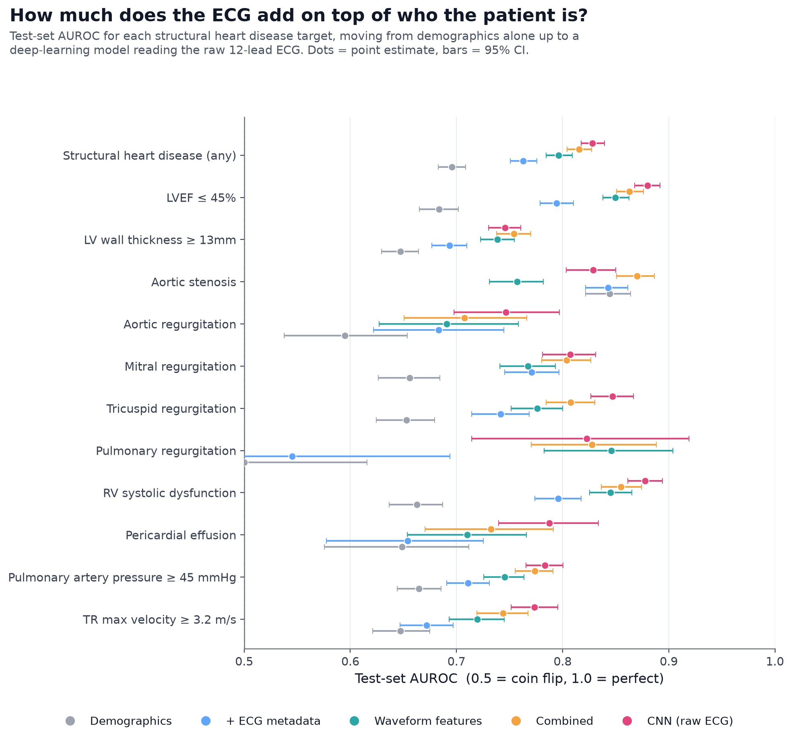
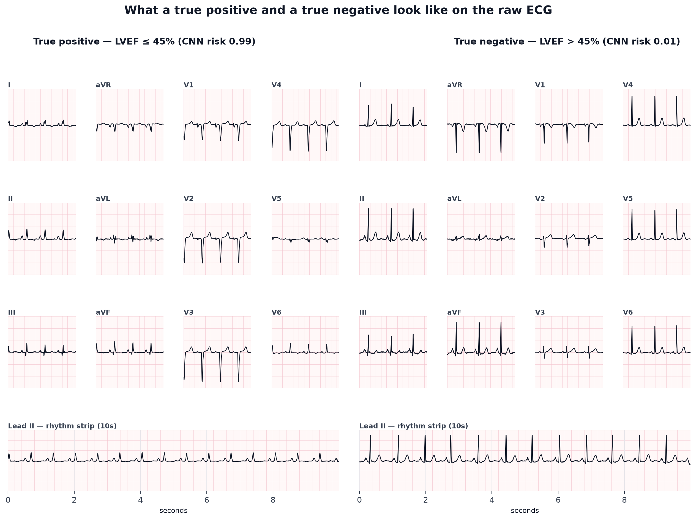
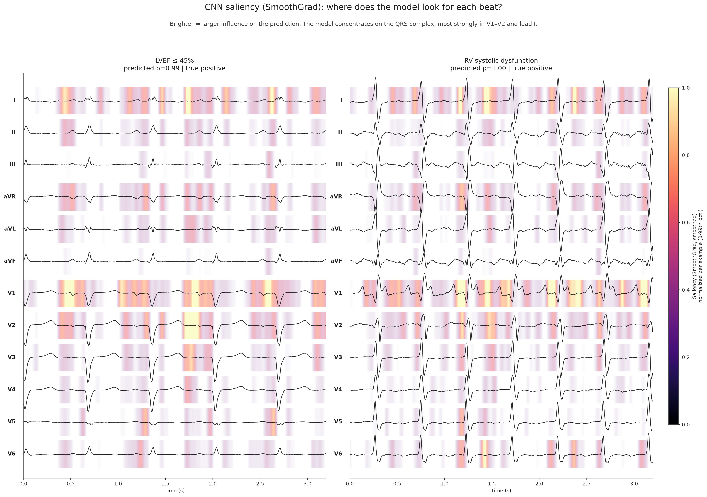
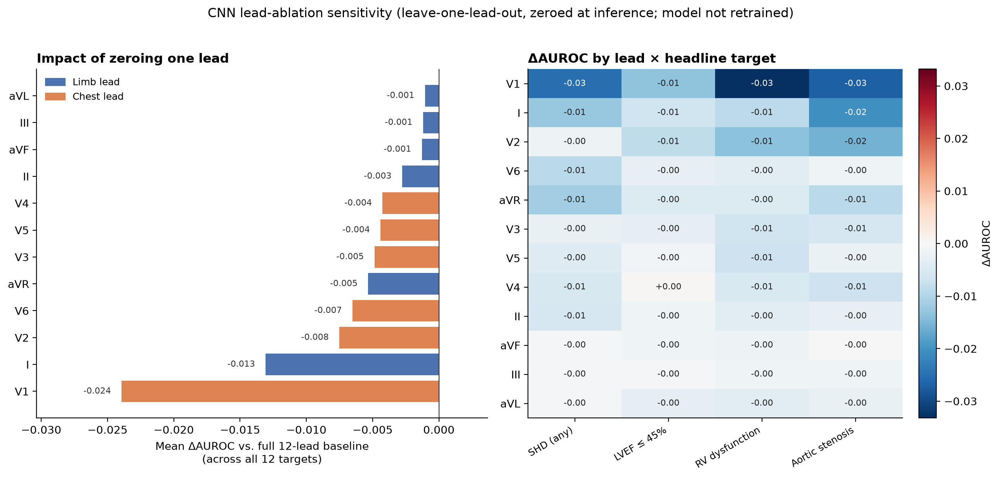
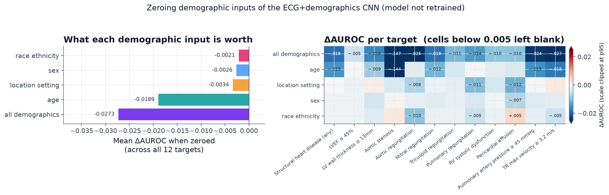
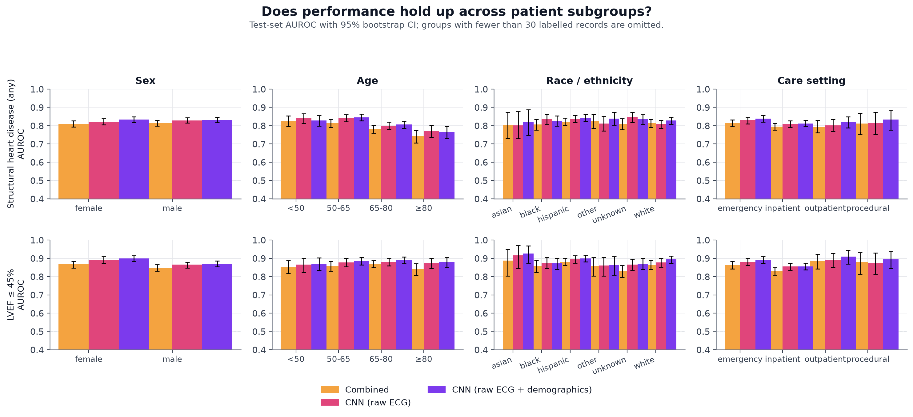
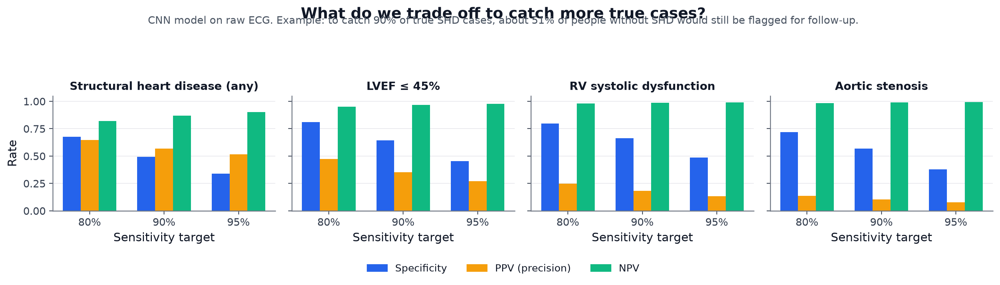

# EchoNext: ECG-Based Structural Heart Disease Detection

Predicting echocardiogram-confirmed structural heart disease from 12-lead ECGs, comparing demographics, ECG metadata, hand-crafted waveform features and a 1D CNN on the raw signal.

[](https://github.com/Kokonut133/echonet_analysis/actions/workflows/ci.yml)


[Interactive results](https://kokonut133.github.io/echonet_analysis/) | [Model card](MODEL_CARD.md) | [Label definitions](docs/labels.md)



## TL;DR

I predicted 12 echocardiogram-confirmed structural heart disease outcomes from 100,000 12-lead ECGs (EchoNext, PhysioNet). The targets range from a broad "any moderate-or-greater disease" flag down to specific valve and chamber findings.

Six rungs of an information ladder were compared on the same targets and the same splits: demographics alone, demographics plus standard ECG measurements, 180 hand-crafted waveform features, both feature sets combined, a 1D CNN on the raw waveform, and that CNN with demographics fused in. Every extra layer of input improved results on held-out test data, and the fused CNN came out best (0.836 AUROC for any moderate-or-greater disease, 0.888 for reduced ejection fraction).

The more useful finding is that a 180-feature gradient-boosting model you can actually inspect came within 0.02 AUROC of the waveform-only CNN, and beat it on aortic stenosis. Working out why that one target behaved differently turned into the most interesting part of the project.

Every headline gap was then checked against training variance by retraining on 5 folds, against a published baseline on the same split, and for calibration. A section at the end records the experiments that were expected to improve results and did not, since those are what narrow down the remaining explanations.

## Key results

Held-out test split (5,442 ECGs, never used for training or model selection). AUROC ± half the width of a 95% bootstrap confidence interval. Full 12-target table: [reports/final_results_summary.md](reports/final_results_summary.md).

| Input | SHD (any moderate+) | LVEF <= 45% | Aortic stenosis |
|---|---|---|---|
| Demographics only (age, sex, race, setting) | 0.696 ± 0.013 | 0.684 ± 0.018 | 0.844 ± 0.021 |
| Plus standard ECG measurements | 0.763 ± 0.013 | 0.794 ± 0.016 | 0.843 ± 0.020 |
| 180 hand-crafted waveform features | 0.796 ± 0.012 | 0.850 ± 0.012 | 0.757 ± 0.025 |
| Combined tabular + waveform | 0.815 ± 0.012 | 0.863 ± 0.013 | 0.870 ± 0.018 |
| 1D CNN on raw 12-lead waveforms | 0.828 ± 0.011 | 0.880 ± 0.012 | 0.829 ± 0.023 |
| 1D CNN, raw waveforms + demographics | **0.836 ± 0.011** | **0.888 ± 0.011** | **0.879 ± 0.017** |

Three things worth pulling out of that table.

Every extra input helps. Going from who the patient is to what their ECG looks like is worth about 0.14 AUROC on the broad SHD target. Averaged over all 12 targets, each step up adds something: 0.658, 0.722, 0.770, 0.796, 0.811, 0.828.

The deep model wins by less than you might expect. The waveform-only CNN beats the feature-based model by 0.013 to 0.023 AUROC, and on several targets their confidence intervals overlap. A gradient-boosting model over 180 interpretable features gets most of the way there.

**Aortic stenosis went the other way, and chasing that down explains the rest.** Demographics alone (0.844) beat raw waveform features (0.757), and the feature-based model (0.870) beat the CNN (0.829). Patient age largely determines that diagnosis, and a waveform-only CNN never sees age. Feeding demographics into the CNN's classification head recovers 0.050 AUROC on that target and puts it back in front (0.879). The [demographic ablation](reports/ablation_notes.md) agrees: removing age alone costs 0.145 AUROC there, against at most 0.02 on any other target.

### How much of this is real

Four checks, each with its own report.

Training variance: retraining the best model on 5 stratified folds gives a fold-to-fold standard deviation of 0.0025 on the SHD composite. Three of the four headline gaps clear that, aortic stenosis by 15x and SHD and LVEF by about 3x, but RV dysfunction's +0.005 gap does not and is not claimed. Rare targets are much less stable, with a fold std of 0.038 for pulmonary regurgitation ([reports/kfold_summary.md](reports/kfold_summary.md)).

Comparison with a published baseline: the dataset ships as the training data for the published EchoNext Mini-Model on the same train/val/test split, so these numbers sit on the same held-out records as a published result. On the composite target this model reaches parity, with overlapping intervals, from about 0.93M parameters trained for 24 epochs on one consumer GPU. The paper's own figures could not be retrieved directly and are recorded as second-hand ([reports/benchmark_comparison.md](reports/benchmark_comparison.md)).

Calibration: the ranking is good and the probabilities are not. Brier skill score is +0.33 on the SHD composite but -0.84 for RV dysfunction and -2.41 for aortic stenosis, which is worse than always predicting the base rate, with calibration error up to 0.27. That follows from training with `pos_weight`, and Platt or isotonic recalibration fixes it without moving AUROC ([reports/calibration_notes.md](reports/calibration_notes.md)).

Tuning: an Optuna search over the classical models moved them by +0.002 to +0.014 AUROC, so the interpretable baseline the CNN is measured against was already close to its best ([reports/tuning_notes.md](reports/tuning_notes.md)).

## What the model sees



A positive and a negative record side by side, in the standard clinical 12-lead layout. The differences between the two classes are small and spread across leads, which is part of why simple per-lead statistics get close to CNN-level performance.

## Pipeline

| Stage | What it does | Script |
|---|---|---|
| 1. Explore | Dataset inventory, label prevalence, example ECGs | `scripts/1_explore/generate_overview.py` |
| 2. Feature extraction | 180 per-lead time and frequency statistics, cached as `.npy` | `scripts/2_preprocess/extract_waveform_features.py` |
| 3. Baseline | Demographics-only models | `scripts/3_baselines/demographic_only.py` |
| 4. Classical ML | LogReg, RandomForest and GradientBoosting on tabular, waveform and combined features | `scripts/4_classical_ml/compare_ecg_feature_sets.py` |
| 5. Deep learning | 1D ResNet on raw waveforms, plus variants with demographics fused in and with normalization + augmentation | `scripts/5_deep_learning/` |
| 6. Evaluation | Held-out test set scored once, bootstrap CIs, result figures | `scripts/6_evaluate/evaluate_test_set.py`, `scripts/7_figures/` |
| 7. Analysis | Saliency, lead and demographic ablation, feature importance, results site | `scripts/8_interpretability/`, `scripts/9_ablation/`, `scripts/10_site/` |
| 8. Validation | 5-fold training variance, calibration and recalibration | `scripts/6_evaluate/kfold_cnn.py`, `calibration_analysis.py` |
| 9. Search | Optuna over the classical models; overnight GPU stage runner | `scripts/11_tuning/`, `scripts/12_overnight/` |

## Further analyses

### Interpretability



SmoothGrad input-gradient saliency and Grad-CAM (on the CNN's last residual stage) show which parts of the waveform drive a prediction. Attention concentrates on V1 and lead I, and within each beat on the window just after the R peak (the ST segment and early T wave), which lines up with the known ECG correlates of structural disease.

### Lead ablation



Zeroing one lead at a time at inference measures how much the trained CNN leans on each of the 12 leads. The model is not retrained, so this is a sensitivity check rather than a "trained on fewer leads" result. V1 and lead I come out on top, and permutation importance on the gradient-boosting model independently agrees. Reduced lead sets are covered too: lead II alone retains only 52 to 77% of full 12-lead AUROC, while the clinical 4-lead set (I, II, V1, V5) holds 86 to 92%.

### Which demographics the fused model uses



Zeroing each demographic input of the fused CNN shows that demographics are worth 0.027 mean AUROC, and age accounts for 69% of that. Age is not a diffuse effect either. It is almost entirely one diagnosis: -0.145 on aortic stenosis against at most 0.02 anywhere else, matching the clinical picture of age-related valve calcification.

Two inputs that could have been a problem turn out not to matter much. Zeroing race/ethnicity moves mean AUROC by -0.002, and care setting, the input most at risk of standing in for "this patient is already known to be unwell", by -0.003. Both have paired bootstrap intervals that span zero on the headline target. Details in [reports/ablation_notes.md](reports/ablation_notes.md).

### Subgroup performance



AUROC split by sex, age band, race/ethnicity and care setting. Results are even across sex and race/ethnicity, with differences inside overlapping confidence intervals. They drop for the oldest patients on the broad SHD target: 0.764 for age 80+ against 0.845 for 50 to 65.

Giving the model age as an input does not close that gap. The fused CNN shows the same deficit for the 80+ group as the waveform-only model, which makes sense once you look at prevalence: 64% of that age band is positive, so age has little left to separate on. Better average accuracy and more even accuracy are not the same goal. Numbers in [reports/subgroup_results.csv](reports/subgroup_results.csv).

### Operating points



What a screening threshold costs in practice. To catch 90% of true structural heart disease cases, the CNN also flags about 51% of people who do not have it. At 80% sensitivity that drops to 32%. A single accuracy number hides this trade-off completely.

## Dataset

[EchoNext](https://physionet.org/) (PhysioNet v1.1.0): 100,000 de-identified 12-lead ECGs at 250 Hz, 10 seconds each, paired with structural heart disease labels read off a matching echocardiogram. Demographics (age, sex, race/ethnicity, care setting) and 7 standard ECG measurements (heart rate, PR/QRS/QTc intervals) come with the raw waveform.

The data is not included in this repository. Download it from PhysioNet and place it under `data/<dataset-folder>/` as described in `data/project_config.json`.

The 12 targets and their prevalence in the full dataset:

| Target | Prevalence |
|---|---:|
| SHD, any moderate-or-greater | 52.2% |
| LV wall thickness >= 13mm | 24.2% |
| LVEF <= 45% | 23.9% |
| PASP >= 45 mmHg | 19.0% |
| RV systolic dysfunction, moderate+ | 13.2% |
| Tricuspid regurgitation, moderate+ | 10.7% |
| TR velocity >= 3.2 m/s | 10.2% |
| Mitral regurgitation, moderate+ | 8.5% |
| Aortic stenosis, moderate+ | 4.1% |
| Pericardial effusion, moderate/large | 3.0% |
| Aortic regurgitation, moderate+ | 1.3% |
| Pulmonary regurgitation, moderate+ | 0.8% |

Full label definitions: [docs/labels.md](docs/labels.md).

## Reproduce

```bash
# install (Python 3.11+)
pip install -e .
pip install -r requirements.txt

# place the downloaded EchoNext files under data/<dataset-folder>/
# see data/project_config.json

python scripts/1_explore/generate_overview.py
python scripts/2_preprocess/extract_waveform_features.py
python scripts/3_baselines/demographic_only.py
python scripts/4_classical_ml/compare_ecg_feature_sets.py
python scripts/5_deep_learning/cnn_waveforms_only.py
python scripts/5_deep_learning/cnn_waveforms_with_demographics.py  # best model
python scripts/5_deep_learning/cnn_waveforms_v2.py                # normalized + augmented
python scripts/6_evaluate/evaluate_test_set.py

# validation and analysis (each writes to reports/ and figures/)
python scripts/6_evaluate/kfold_cnn.py            # training-variance estimate
python scripts/6_evaluate/calibration_analysis.py # Brier, ECE, recalibration
python scripts/7_figures/make_results_figures.py
python scripts/8_interpretability/saliency_examples.py
python scripts/9_ablation/lead_ablation.py
python scripts/9_ablation/demographic_ablation.py

pytest tests -q   # 127 tests, about 2 min, runs on synthetic data
```

## Design decisions

Memory-mapped waveforms (`np.load(..., mmap_mode="r")`). The raw training array is about 16 GB, and nothing in the pipeline loads it fully into RAM.

Hand-crafted per-lead features before reaching for deep learning. 180 time and frequency statistics (12 leads x 15 features) shrink the 16 GB array to roughly 50 MB, which makes classical-ML iteration fast and gives the CNN something honest to be compared against.

Masked BCE with per-label `pos_weight`. Labels are missing for between 9 and 55% of rows depending on the echo sub-measurement, and prevalence ranges from 0.8% to 52%. Masking drops missing rows from each label's loss term, and `pos_weight` handles the class imbalance without throwing data away.

One model for all 12 targets. The CNN uses a shared backbone with 12 output logits rather than 12 separate networks. The sklearn models fit one estimator per target and feature set.

Early stopping on mean validation AUROC. A single scalar drives both early stopping and learning-rate reduction, instead of keeping per-target checkpoints.

The official splits, with the test set left alone. Train, validation and test come from the dataset's own `split` column, and the test split is scored exactly once, at final evaluation.

Bootstrap confidence intervals on every reported number, so the size of a difference can be judged against the noise. Per-tier test predictions are cached in `reports/predictions/`, which means a new checkpoint can be scored in minutes instead of rerunning the classical models.

## Limitations

Labels come from echocardiogram reports rather than a separate adjudication panel, so reader variability is an unmeasured source of label noise.

The rare targets (pulmonary regurgitation at 0.8%, aortic regurgitation at 1.3%) have reasonable AUROC but low AUPRC. At any practical threshold the models miss most positives.

Performance looks limited by the data rather than by regularization or optimization. Three training regimes land in the same place, which is set out in the section below on what did not work.

Subgroup results are reported but not acted on. Nothing has been recalibrated or reweighted in response to the age-band gap.

No external validation. Every number here is internal to the EchoNext splits.

## Experiments that did not pay off, and what they ruled out

Five things were tried that were expected to improve results and did not. Each one removed a candidate explanation, which is why they are recorded here rather than dropped.

Per-record normalization and waveform augmentation. Time shift, amplitude scaling, baseline wander and noise delayed overfitting exactly as intended, moving the best epoch from 10 to 17, but mean test AUROC came out at 0.804 against 0.811 for the unaugmented model, with every per-target interval overlapping. Regularization was not what was holding the model back ([reports/cnn_v2_notes.md](reports/cnn_v2_notes.md)).

A longer run with warmup and cosine decay. This one did fix a real problem. The fixed-LR runs were still improving at epoch 19 of 20, which looked like the epoch budget being the ceiling. With a proper schedule the model peaks at epoch 12 and then declines for 12 straight epochs, so the budget was never the constraint. It still produced no better model: scored once on test, no per-target change against the previous best exceeds 2 fold standard deviations, so every apparent gain and loss sits inside training noise. Without the fold-variance estimate, the +0.009 on RV dysfunction would have been written up as an improvement ([reports/serial_notes.md](reports/serial_notes.md)).

Warm-started tuning of the late-training phase. Resuming from a checkpoint and searching over LR tail, weight decay and dropout beat its own control arm by +0.005, but both sat well below the peak the long run had already reached. The cause was a design mistake worth recording: the warm-start point was a fixed 3/4 of the epochs, which landed at epoch 18, already past the epoch-12 peak. It should have resumed from the best checkpoint.

Tuning the classical models. Two hundred trials bought +0.002 to +0.014 AUROC. That is a poor improvement and useful evidence, because it means the comparison between the CNN and the interpretable model was never resting on an unfairly untuned baseline.

Adding age as an input to close the age-band gap. AUROC for patients 80 and over is 0.764 against 0.845 for 50 to 65. Giving the model age does not close it, because 64% of that age band is positive and age has little left to separate on within it. Higher average accuracy and more even accuracy are different objectives.

Two things I expected to find and did not. Zeroing race/ethnicity moves mean AUROC by -0.002 and care setting by -0.003, both with intervals spanning zero, so neither input carries much weight, and the concern that care setting was standing in for "this patient is already known to be unwell" does not hold up. A check of the `patient_key` column also confirmed that the official train, validation and test splits share no patients, so the results are not inflated by a model recognising someone it had already seen.

Together these narrow the explanation for the ceiling around 0.83. Learning rate, schedule, regularization, augmentation and classical hyperparameters are all ruled out. What remains is label noise from echo-derived targets, the limits of what 10 seconds of ECG encodes about cardiac structure, and model capacity this hardware cannot reach. The elimination sweep did turn up one concrete lead: every surviving learning rate fell between 1.5e-4 and 3.6e-4, while the hand-picked 1e-3 sits outside that band, and a 5-epoch run inside it came within 0.002 of the 24-epoch run.
